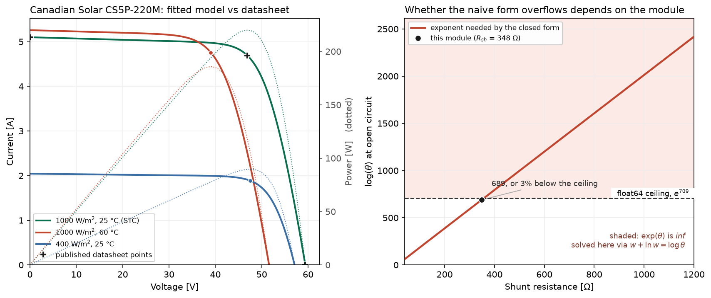

# single-diode

[](https://github.com/valentinmann/single-diode/actions/workflows/ci.yml?query=branch%3Amain)
[](pyproject.toml)
[](LICENSE)

A solar module datasheet gives you four numbers and two temperature
coefficients. The single diode equivalent circuit needs five parameters. This
package gets from one to the other, and then to the module's I-V curve at any
irradiance and cell temperature.



## Run it

```bash
git clone https://github.com/valentinmann/single-diode.git
cd single-diode
python -m venv .venv
source .venv/bin/activate        # Windows: .venv\Scripts\activate
pip install -e ".[dev]"
python examples/datasheet_to_iv.py
```

A few seconds, no data to download. It fits a real published module, checks
the fit against the published values, shows what the model predicts when the
module is hot or shaded, runs two maximum power point trackers, and writes the
figure above.

```
[2/4] Reproducing the published values
  Isc [A]   model    5.1000   published    5.1000   error  0.0000 %
  Voc [V]   model   59.4000   published   59.4000   error  0.0000 %
  Imp [A]   model    4.6900   published    4.6900   error  0.0000 %
  Vmp [V]   model   46.9000   published   46.9000   error  0.0000 %
  Pmp [W]   model  219.9610   published  219.9610   error  0.0000 %
```

Those zeros show that the solver converged, not that the model is right. The
fit is required to pass through `(0, Isc)`, `(Voc, 0)` and `(Vmp, Imp)` and to
reach its maximum power at the last, and `Pmp` is `Imp` times `Vmp`, so every
converged fit reproduces all five by construction.

Away from datasheet conditions the model moves the right way: open-circuit
voltage falls and short-circuit current rises at the published temperature
rates, and the fill factor improves as the light falls. That is consistency
rather than validation, because both rates were inputs, one to the fit and
one to the translation.

## What is actually hard here

**Start with [`src/single_diode/lambertw.py`](src/single_diode/lambertw.py).**
The single diode equation is implicit in current and has a closed-form
solution through the Lambert W function. That closed form is unusable as
written: it needs `W(theta)` where `log(theta) = Rsh*IL/a` runs from 286 to
2757 across the modules tested here, and double precision stops at `e^709`.
Above the ceiling the argument is not a large number, it is `inf`, and every
value downstream becomes `nan` with no error raised.

The fix is to never form `theta`. Writing `w = W(e^x)` and taking logs of
`w e^w = e^x` gives `w + ln(w) = x`, which is well conditioned for any finite
`x`, and solving that is one short Halley iteration.

Whether a given module overflows is not something you can tell from its
datasheet - the one fitted in the example sits 3% below the ceiling, and a
slightly better shunt resistance would push it over.

**Then [`src/single_diode/extract.py`](src/single_diode/extract.py).** Fitting
the five parameters is a five-equation nonlinear system, and it is a
domain-of-attraction problem rather than a scaling one. `I0` enters through
`exp(V/a)`, so the textbook estimate of `a` - which ignores both resistances
and comes out 50 to 130% high - implies an `I0` wrong by four orders of
magnitude. The fix is a multi-start over the ideality factor, which is the one
poorly known quantity and lives on a short physical interval.

Worse, whether a single start converges depends on the machine:
`scipy.optimize.root(method="lm")` is MINPACK, and MINPACK compiled against a
different LAPACK takes a different path out of a badly conditioned start. A
fit whose success depends on which BLAS was linked is not one to rely on,
which is the argument for the multi-start.

This is a real difficulty, not a self-inflicted one: pvlib's `fit_desoto`
carried a convergence failure of the same kind
([pvlib-python#1014](https://github.com/pvlib/pvlib-python/issues/1014)),
converging for `I0 = 1e-10 A` and failing for `8e-10 A`.

## What the tests caught

```bash
pytest                                  # 154 tests, including the docstring examples
pytest --cov --cov-report=term-missing  # 97% line and branch coverage
nox                                     # lint, strict types and tests: exactly what CI runs
```

Those two numbers are what those two commands print on a clean clone. There is
no coverage badge because coverage is not published anywhere: CI keeps the
report as a build artifact rather than sending it to a third party, and a
badge nobody can reproduce is worth less than a command anybody can run.

Four things, each of which produced plausible output and none of which a
smoke test would have found. The first three were caught locally; the fourth
only by running the suite on three operating systems.

1. **A silently wrong Lambert W.** The iteration started from the omega
   constant in the mid range, which is a fine guess near `x = 0` and hopeless
   by `x = -25`, where the root is `1e-11`. It ran out of iterations while
   still halving towards it and returned the unconverged value. A
   monotonicity check over a sweep found it, and the solver now raises rather
   than returning an answer it does not believe.

2. **A convergence test that could never pass.** The replacement guard judged
   convergence on step size. Near the root consecutive steps oscillate at the
   last bit without shrinking, so it rejected residuals of `2e-15` - already
   exact - and raised. The criterion now tests the specification, `w + ln(w)
   = x`, rather than the search.

3. **A design belief that was simply wrong.** This package was first written
   on the assumption that the fit fails because the unknowns span twelve
   orders of magnitude, and that solving for `log(I0)` and `log(Rsh)` would
   settle it. Measured across the corpus, it does not: an unbounded
   `log(Rsh)` lets the solver escape to `Rsh = 1e8` for the price of a small
   step and stall in a spurious minimum there. Both parameterisations succeed
   from a good start and fail from a bad one. The parameterisation is kept as
   an option, the multi-start is what is defended, and
   [`tests/test_extract.py`](tests/test_extract.py) measures the claim so it
   stays falsifiable.

4. **A test that was only true on my machine.** One test asserted that a
   single start from the textbook estimate *fails*. It did, locally, and it
   survived a deliberate probe that perturbed the inputs. Then CI failed it on
   Linux and macOS, where the same solve converges - the probe had varied the
   inputs but not the linear algebra backend. Asserting that a numerical
   solver fails is not portable. The test now asserts the portable half:
   wherever a single start succeeds the multi-start agrees with it, and the
   multi-start succeeds everywhere.

The same discipline is applied where it is less flattering. Incremental
conductance is usually described as immune to changing irradiance; measured
here under a ramp it follows an identical trajectory to perturb and observe,
because any discrete implementation estimates `dI/dV` from samples taken on
different curves. The test asserts that they tie, and says what would have to
change for the textbook claim to hold.

## Layout

```
src/single_diode/
  lambertw.py    W(e^x) without forming e^x
  model.py       the single diode equation, solved three independent ways
  extract.py     five parameters from a datasheet, by multi-start
  translate.py   De Soto translation to other irradiance and temperature
  curves.py      I-V and P-V curves; the maximum power point as a root, not a grid search
  mppt.py        perturb and observe, incremental conductance
  datasheet.py   published values, validated at construction
examples/
tests/
```

Agreement between the three independent solvers is the strongest correctness
check in the package, and it is asserted across every module in the corpus: a
wrong closed form can still be self-consistent, so a residual check alone
would not catch it.

## Development

Everything CI runs is one command locally, through
[nox](https://nox.thea.codes):

```bash
nox              # lint, types, tests
nox -s tests     # tests on every installed interpreter, 3.10 to 3.13
nox -s coverage  # the coverage report quoted above, through nox
nox -s build     # build the distributions and validate their metadata
```

Checks in place: `ruff` with the Scientific Python rule set, `ruff format`,
`mypy --strict`, `pytest` with `-ra --strict-config --strict-markers`,
warnings promoted to errors, docstring examples executed, and `pre-commit`
running all of it plus `typos` and `zizmor` (static analysis of the CI
workflows). See [CONTRIBUTING.md](CONTRIBUTING.md).

## Scope

A teaching-grade implementation of a textbook model, written from scratch,
dependency-light and heavily tested. [pvlib](https://pvlib-python.readthedocs.io)
is the mature library for this domain and does all of it better; nothing here
is novel, and the point is the engineering rather than the physics.

Only crystalline silicon is fitted, only the De Soto translation is
implemented, and there is no spectral or angle-of-incidence correction, no
thermal model and no bifacial handling.

The one real module's published values come from the California Energy
Commission module database. Everything else in the test corpus is synthetic
and generated from known parameters, which is deliberate: a datasheet gives
four points and no ground truth, so a fit to one can only be checked against
what it was handed, while a synthetic module has an exact answer to recover.

What none of this provides is validation against measurement. Nothing here
compares the model with a measured I-V curve, a flash test, or the module's
behaviour at another irradiance or temperature, so the round trips establish
that the fitting procedure is correct, not that a single diode with De Soto
translation describes this module away from its datasheet.

## Provenance

Built with an AI coding assistant. The design is mine: which failures to look
for, which invariants are worth asserting, and the decision to keep the
measurement that contradicted the original premise rather than quietly
changing the premise.
